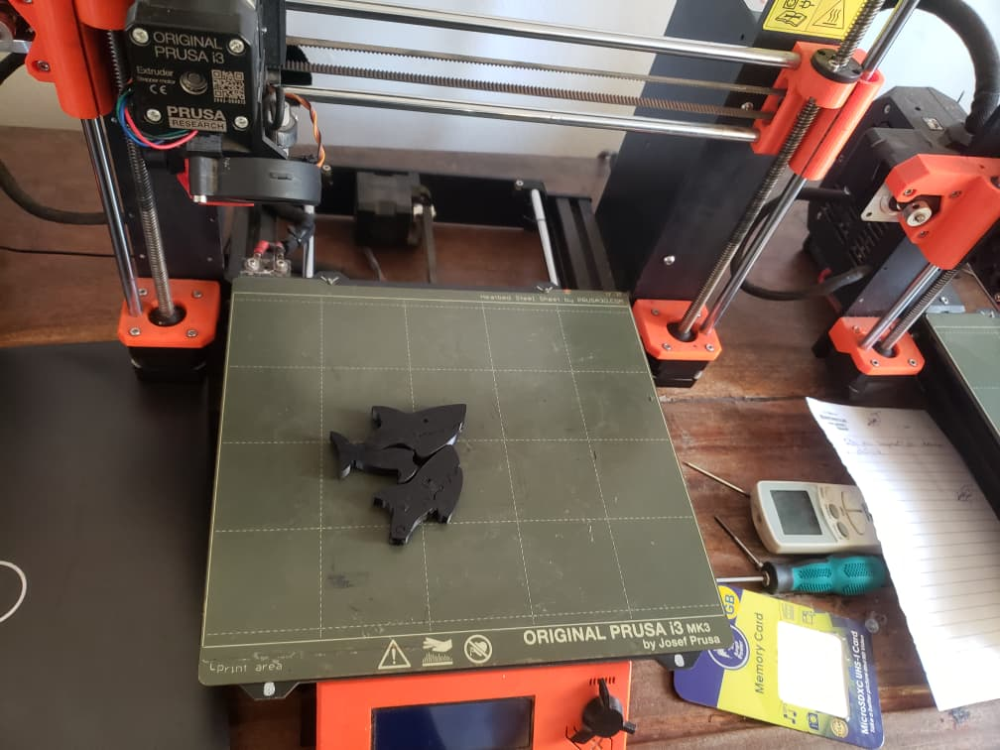

# Journal  mercredi 26 août 2026

**Auteur : DOPE Kossi**

## Fait aujourd'hui

* Répartition des participants en **4 groupes** pour effectuer une rotation dans les différents ateliers.
* Découverte des quatre ateliers :

  * **Atelier électronique**
  * **Atelier d'impression 3D**
  * **Atelier programmation**
  * **Atelier découpe laser**
* Dans l'atelier de découpe laser, travail organisé autour de trois parties : **comprendre, comparer et choisir**.
* Étude de la question : **qu'est-ce qu'un laser ?**
* Présentation des **grandes familles de lasers industriels**.
* Étude de la **précision et de la qualité de coupe**.
* Réflexion sur les critères permettant de **choisir une machine laser**.

## Appris

* Une organisation en **4 groupes** permet de faire une rotation entre différents ateliers.
* Les activités proposées couvrent quatre domaines : électronique, impression 3D, programmation et découpe laser.
* L'étude de la découpe laser peut être structurée en **3 étapes : comprendre, comparer et choisir**.
* Plusieurs familles de lasers industriels existent.
* La **précision** et la **qualité de coupe** sont des éléments à prendre en compte lors du choix d'une machine laser.

## Raté, puis corrigé

* La diversité des ateliers rendait difficile la découverte simultanée de toutes les activités → organisation des participants en **4 groupes** avec une rotation entre les ateliers → chaque groupe peut ainsi découvrir progressivement les différents domaines.

## Décidé

* Adopter une organisation par **rotation des 4 groupes** dans les différents ateliers afin de permettre à chacun de découvrir les différentes technologies.
* Pour la découpe laser, retenir l'approche **comprendre → comparer → choisir** comme méthode de travail.

## À faire demain

* Poursuivre la rotation dans les différents ateliers 
* Approfondir les notions étudiées sur la découpe laser 
* Documenter les activités réalisées avec les photos des ateliers 
