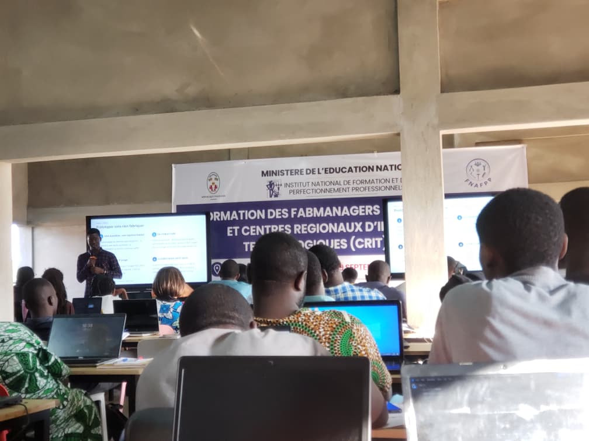

# Journal  vendredi 28 août 2026

**Auteur : DOPE Kossi**

## Fait aujourd'hui

- À l'atelier électronique, tentative de programmation de l'allumage automatique des LED en fonction de la luminosité ambiante.
- Deuxième programmation réalisée avec un **capteur de lumière** : les LED s'allument lorsque l'intensité lumineuse détectée est **inférieure à 31**.
- À l'atelier impression 3D :
  - Copie du fichier.
  - Impression d'un fichier avec l'imprimante **Bambu Lab P2S**.
- À l'atelier découpe laser, révision des notions étudiées précédemment.
- Discussion sur le **cahier des charges des projets**.
- Étude du **Design Thinking** et de la méthode spirale.
- Découverte de la notion de **prototype** : représentation, croquis, scénario et fabrication.

## Appris

- Un capteur de lumière peut être utilisé pour commander automatiquement l'allumage des LED.
- Le seuil utilisé lors de la programmation était une intensité lumineuse **inférieure à 31**.
- L'impression 3D nécessite notamment la préparation et la copie du fichier avant son impression.
- Le **cahier des charges** permet de définir les éléments à prendre en compte dans un projet.
- Le **Design Thinking** fait partie des méthodes abordées pour développer un projet.
- Un prototype peut prendre différentes formes : **représentation, croquis, scénario ou fabrication**.

## Raté, puis corrigé

- La première programmation de l'allumage automatique des LED en fonction de la luminosité a été ratée → la condition de fonctionnement n'était pas correctement définie → utilisation d'un capteur de lumière avec un seuil d'intensité **< 31** → fonctionnement automatique de l'allumage des LED obtenu.

## Décidé

- Utiliser une valeur seuil de **31** pour déterminer la condition d'allumage automatique des LED → la LED s'allume lorsque l'intensité lumineuse détectée est inférieure à cette valeur.
- Intégrer le **Design Thinking** et la notion de prototype dans la réflexion sur les projets → permettre de passer de l'idée à une représentation puis à une réalisation.

## À faire demain

- Poursuivre les activités pratiques des différents ateliers 
- choix des thèmes de projet 
- Documenter les travaux réalisés avec les photos correspondantes 