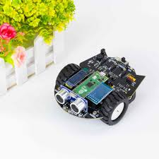

# Journal du mercredi 2 septembre 2026

**Auteur : DOPE Kossi**

## Fait aujourd'hui

- Réalisation de l'**esquisse de notre projet en groupe**.
- Étude de l'**algorithme débranché**, notamment :
  - définition ;
  - exemple.
- Introduction au **pseudo-code**.
- Étude des **critères qui définissent un algorithme**.
- Programmation d'un **robot** dans l'atelier électronique.

## Appris

- Un algorithme peut être étudié sans utiliser directement un ordinateur à travers l'**algorithme débranché**.
- Le **pseudo-code** permet de représenter les étapes d'un algorithme.
- Un algorithme doit respecter certains **critères de définition**.
- Les notions étudiées ont été mises en pratique avec la **programmation d'un robot** dans l'atelier électronique.
- L'esquisse permet de commencer à représenter le projet en groupe avant sa réalisation.

## Raté, puis corrigé

- La compréhension d'un algorithme nécessite de distinguer sa définition, ses étapes et sa représentation → étude de l'algorithme débranché, du pseudo-code et de ses critères → meilleure compréhension de la démarche algorithmique avant la programmation du robot.

## Décidé

- Poursuivre la conception de notre projet à partir de l'**esquisse réalisée en groupe**.
- Utiliser la démarche algorithmique avant la programmation afin de mieux organiser les étapes de fonctionnement du projet.

## À faire demain

- Poursuivre l'esquisse et la conception du projet
- Approfondir le pseudo-code et les critères d'un algorithme
- Poursuivre la programmation du robot