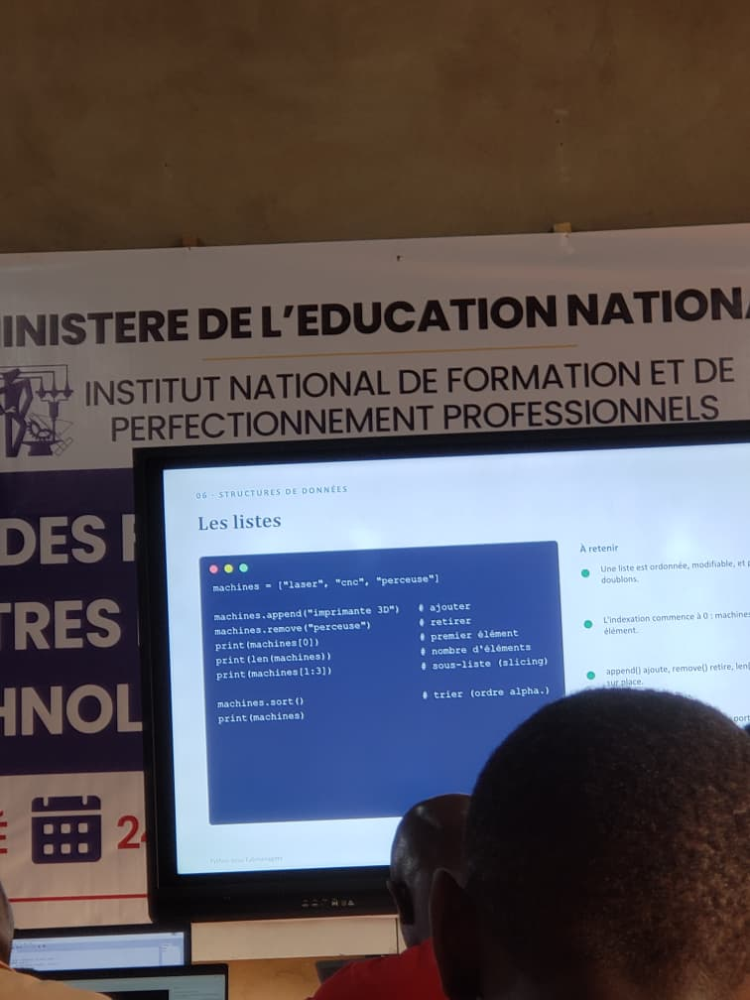

# Journal du vendredi 4 septembre 2026

**Auteur : DOPE Kossi**

## Fait aujourd'hui

- Découverte de la notion de **PCB (Printed Circuit Board)**.
- Conception d'une **pièce dans Fusion 360**.
- Poursuite de l'apprentissage de la programmation Python avec :
  - la boucle `for` ;
  - la boucle `while` ;
  - les tuples ;
  - les dictionnaires.
- Réalisation d'un **exercice de programmation** mettant en pratique les notions étudiées.

## Appris

- Découverte de la notion de **PCB** et de son utilisation dans la conception électronique.
- Poursuite de la maîtrise de **Fusion 360** à travers la conception d'une pièce.
- Découverte des boucles `for` et `while` en Python.
- Découverte des structures de données **tuple** et **dictionnaire**.

## Raté, puis corrigé

- La programmation avec plusieurs structures de contrôle et de données nécessite de bien distinguer leur utilisation → étude des boucles `for` et `while`, des tuples et des dictionnaires → réalisation d'un exercice pour mettre en pratique les notions étudiées.

## Décidé

- Poursuivre l'apprentissage de Python à travers des exercices pratiques afin de mieux maîtriser les différentes structures du langage.
- Continuer la conception et la modélisation des pièces avec **Fusion 360**.

## À faire demain

-  Poursuivre les exercices de programmation Python
