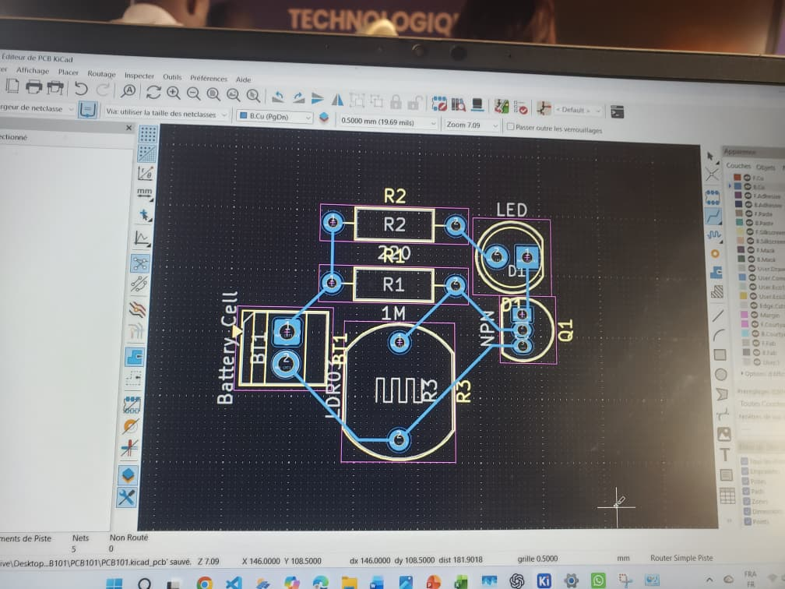
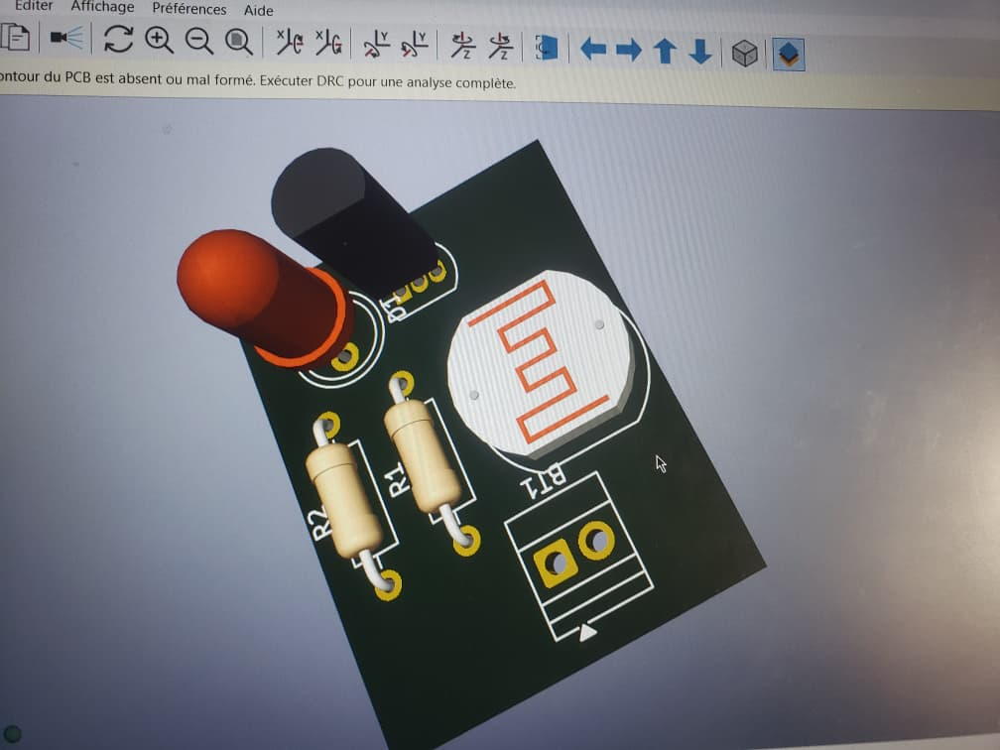

# Journal du lundi 7 septembre 2026

**Auteur : DOPE Kossi**

## Fait aujourd'hui

- Suivi d'un cours pour comprendre les notions liées au **PCB**.
- Installation du logiciel **Kicad**.
- Réalisation d'un **circuit électronique avec le logiciel Kicad**.
- Conception d'un circuit portant sur un **interrupteur crépusculaire**.

## Appris

- Découverte des notions nécessaires à la compréhension d'un **PCB**.
- Installation et prise en main du logiciel **Kicad**.
- Utilisation de Kicad pour réaliser un circuit électronique.
- Découverte de la conception d'un **interrupteur crépusculaire** avec Kicad.

## Raté, puis corrigé

- La fiche ne précise pas de difficulté particulière rencontrée aujourd'hui → aucune correction spécifique n'a été renseignée.

## Décidé

- Poursuivre l'apprentissage de **Kicad** afin de mieux maîtriser la conception de circuits électroniques et les notions liées aux PCB.
- Continuer le travail sur le circuit de l'**interrupteur crépusculaire**.

## À faire demain

- Poursuivre la conception du circuit sur Kicad
- Approfondir les notions sur les PCB
- Continuer l'apprentissage de Kicad