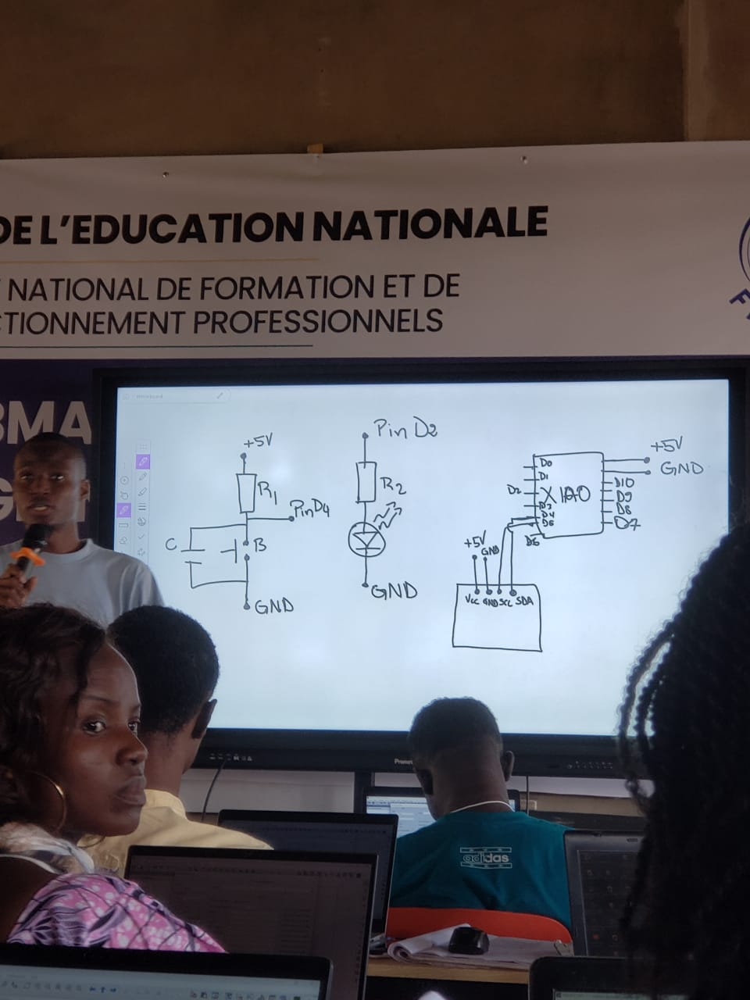

# Journal du mercredi 9 septembre 2026

**Auteur : DOPE Kossi**

## Fait aujourd'hui

- Travail sur la **conception d'un PCB**.
- Création de composants électroniques qui ne sont pas disponibles dans la bibliothèque de **KiCad**, notamment un **écran OLED**.
- Poursuite de la conception du circuit en intégrant les composants nécessaires au projet.
- Révision des notions liées à **l'informatique**.
- Poursuite des activités de **programmation**.

## Appris

- La conception d'un PCB peut nécessiter la création de composants personnalisés lorsque ceux-ci ne sont pas disponibles dans la bibliothèque de KiCad.
- L'**écran OLED** constitue un exemple de composant pour lequel une création personnalisée peut être nécessaire.
- La conception d'un circuit électronique demande de vérifier la disponibilité des composants dans la bibliothèque avant leur intégration.
- Les notions d'**informatique** ont également été revues au cours de la séance.
- La **programmation** fait partie des activités poursuivies pendant la formation.

## Raté, puis corrigé

- Certains composants nécessaires au projet ne sont pas disponibles directement dans la bibliothèque de KiCad → impossibilité d'utiliser directement le composant correspondant → création du composant manquant, notamment pour l'**écran OLED** → possibilité de poursuivre la conception du PCB.

## Décidé

- Créer les composants personnalisés nécessaires lorsqu'ils ne sont pas disponibles dans la bibliothèque de KiCad → permettre de poursuivre la conception du PCB avec les composants réellement utilisés dans le projet.
- Continuer en parallèle les activités de **programmation** et la révision des notions d'informatique.

## À faire demain

-  Poursuivre la conception du PCB
- Finaliser les composants personnalisés nécessaires dans KiCad
- Vérifier l'intégration de l'écran OLED dans la conception
- Poursuivre les activités des groupes