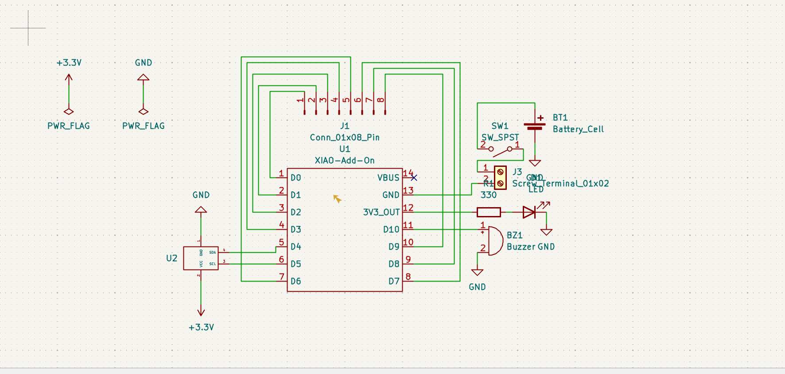

# Journal du vendredi 11 septembre 2026

**Auteur : DOPE Kossi**

## Fait aujourd'hui

- Travail individuel et en groupe sur la **conception du PCB de notre projet**.
- Poursuite de la conception de la carte électronique en fonction des composants prévus pour le projet.
- Vérification et ajustement de la conception du PCB.
- Le travail de conception n'a pas pu être terminé au cours de la journée.

## Appris

- La conception d'un PCB nécessite de travailler progressivement sur l'organisation et l'intégration des différents composants du projet.
- La réalisation d'une carte électronique demande des vérifications avant de pouvoir finaliser sa conception.
- Le travail sur le PCB doit être poursuivi jusqu'à obtenir une conception complète et exploitable.

## Raté, puis corrigé

- Le PCB n'a pas pu être finalisé aujourd'hui → le travail de conception demande encore des vérifications et des ajustements → poursuite du travail prévue le lendemain → conception du PCB à finaliser demain.

## Décidé

- Reporter la finalisation du **PCB** au lendemain afin de poursuivre les vérifications et les ajustements nécessaires.
- Continuer le travail sur la même conception plutôt que de passer à l'étape suivante avant que le PCB soit suffisamment avancé.

## À faire demain

- Poursuivre la conception du PCB
- Effectuer les vérifications nécessaires
- Corriger les éventuelles erreurs de conception
-Finaliser le PCB de notre projet