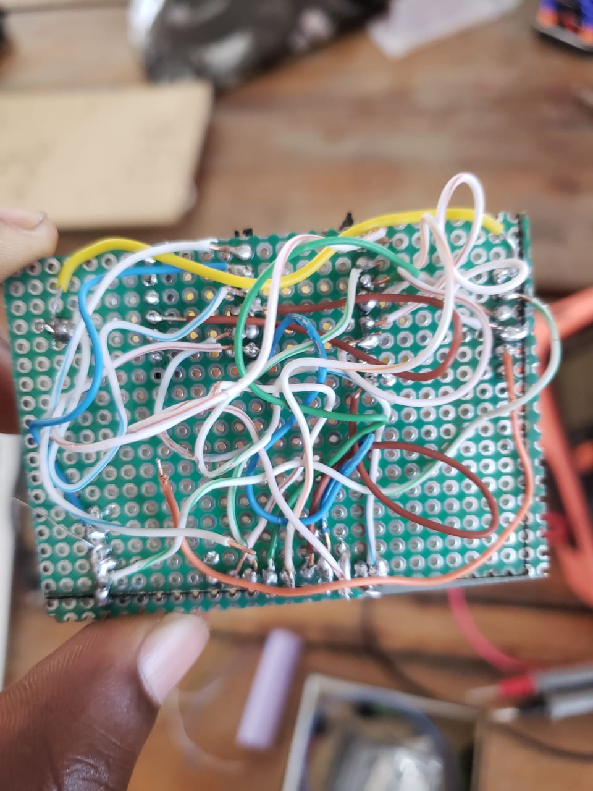
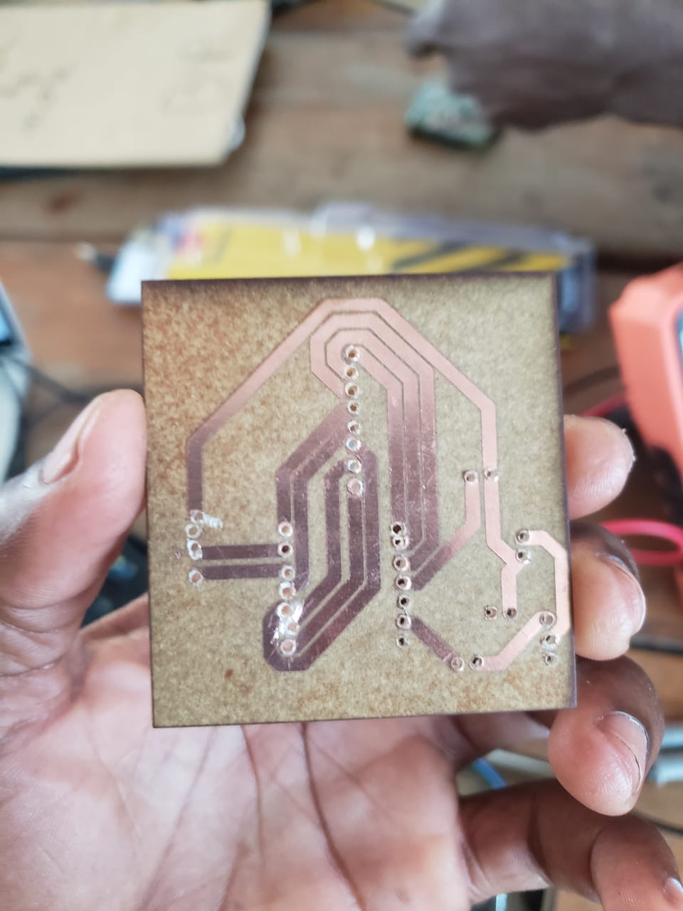

# Journal du mardi 15 septembre 2026

**Auteur : DOPE Kossi**

## Fait aujourd'hui

- Poursuite du travail sur la **fabrication du PCB** de notre projet.
- Réalisation de l'**impression du PCB** à partir de la conception préparée précédemment.
- Vérification des dimensions du PCB imprimé.
- Identification d'une mise à jour nécessaire concernant les **dimensions de la carte**, qui sera effectuée prochainement.
- Préparation de l'étape suivante : **soudure des composants sur le PCB**.

## Appris

- La fabrication d'un PCB nécessite de vérifier les dimensions de la carte avant son intégration dans le prototype.
- L'impression permet de passer de la conception numérique à une réalisation physique.
- Une modification des dimensions peut être nécessaire pour adapter le PCB aux contraintes du projet.
- La prochaine étape consistera à **souder les composants directement sur le PCB**.

## Raté, puis corrigé

- Les dimensions du PCB nécessitent encore une mise à jour → certaines dimensions doivent être adaptées au prototype → modification des dimensions prévue prochainement → PCB à ajuster avant la soudure définitive des composants.

## Décidé

- Mettre à jour prochainement les **dimensions du PCB** avant de poursuivre l'assemblage définitif.
- Préparer ensuite la **soudure des composants sur le PCB** une fois les dimensions validées.

## À faire demain

-  Mettre à jour les dimensions du PCB
- Vérifier les dimensions de la carte avant fabrication définitive
- Préparer les composants pour la soudure
- Commencer la soudure des composants sur le PCB