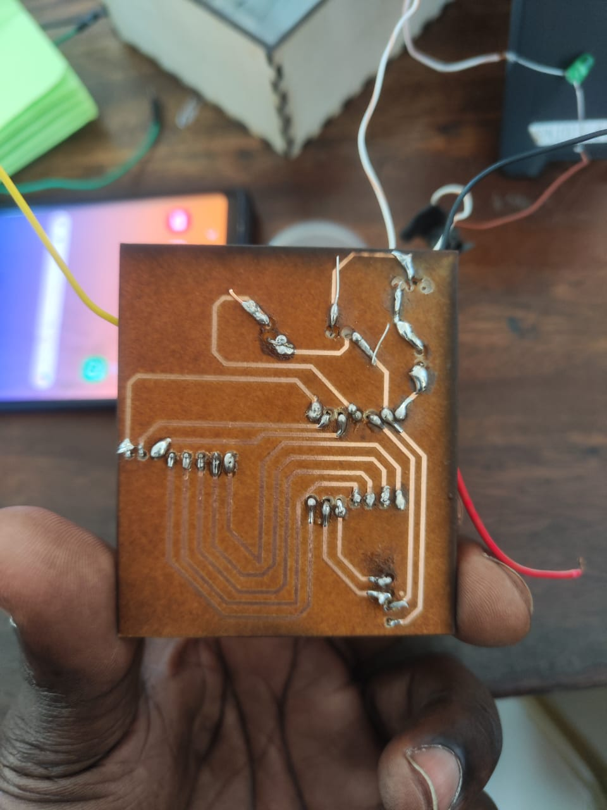
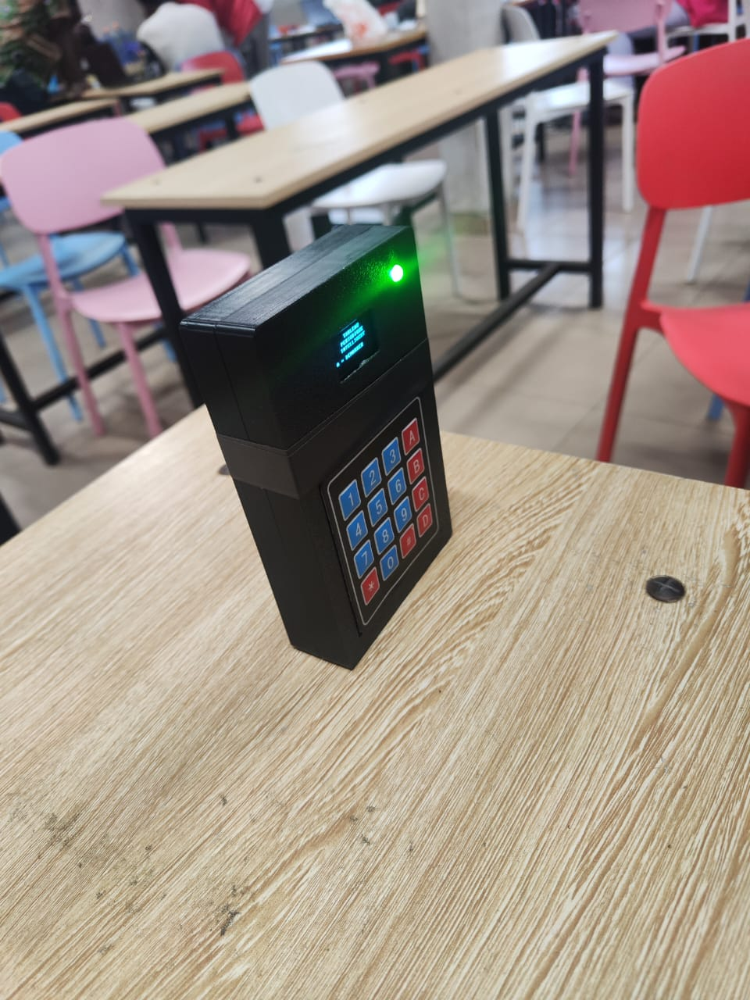

# Journal — jeudi 17 septembre 2026

**Auteur : DOPE Kossi**

## Fait aujourd'hui

- Poursuite des derniers travaux sur notre projet.
- Réalisation des dernières étapes d'assemblage et d'intégration du prototype.
- Réalisation de plusieurs essais afin de vérifier le fonctionnement général du système.
- Plusieurs **échecs et difficultés** ont été rencontrés pendant les essais.
- Recherche et correction progressive des problèmes rencontrés.
- Après plusieurs tentatives et corrections, **finalisation du projet**.
- Préparation du projet pour sa **présentation finale prévue demain**.

## Appris

- La réalisation d'un projet ne se déroule pas toujours comme prévu et nécessite plusieurs essais.
- Les échecs permettent d'identifier les problèmes et d'apporter progressivement les corrections nécessaires.
- La phase finale demande de vérifier l'ensemble du projet avant sa présentation.
- Après plusieurs essais et corrections, nous sommes finalement arrivés à **terminer notre projet**.
- La préparation de la présentation constitue la dernière étape avant la présentation du travail réalisé.

## Raté, puis corrigé

- Plusieurs essais du projet ont échoué → recherche des causes des différents problèmes → modifications et corrections successives → nouveaux essais → **projet finalement terminé et fonctionnel**.

## Décidé

- Finaliser le projet aujourd'hui malgré les difficultés rencontrées afin d'être prêts pour la présentation.
- Consacrer la journée de demain à la **présentation du projet** et à la démonstration du travail réalisé.

## À faire demain

-  Présenter le projet devant les participants et les encadreurs
- Expliquer la problématique et les objectifs du projet
- Présenter les différentes étapes de conception et de réalisation
- Faire la démonstration du prototype
- Répondre aux questions lors de la présentation